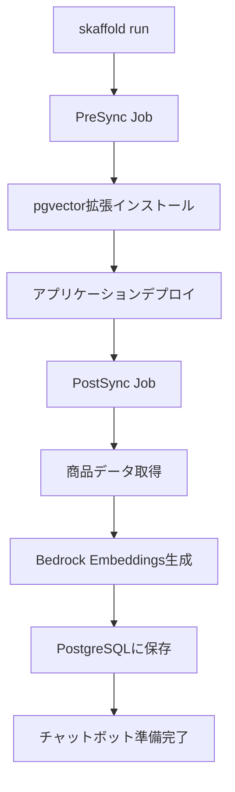

# 🤖 RAG付きLLMチャットボット - 自動デプロイ構成

AWS Bedrock + PostgreSQL + pgvectorを使用したRAG（検索拡張生成）付きチャットボットです。
**Kubernetesデプロイ時に自動的にセットアップされます。**

## ✨ 主な機能

- 🔍 **RAG (Retrieval-Augmented Generation)**: 商品データベースから関連情報を検索
- 🤖 **AWS Bedrock統合**: Claude 3 & Titan Embeddings
- 📊 **ベクトル検索**: pgvectorによる高速類似度検索
- 🚀 **自動セットアップ**: Kubernetes Jobで完全自動化
- 💰 **コスト効率**: OpenAIより50-70%安い

## 🏗️ アーキテクチャ

```
┌─────────────┐
│   ユーザー   │
└──────┬──────┘
       │
       ▼
┌─────────────────────┐
│  フロントエンド      │
│  (チャットUI)        │
└──────┬──────────────┘
       │ /api/chat
       ▼
┌─────────────────────┐      ┌──────────────────┐
│  バックエンドAPI    │─────→│  AWS Bedrock     │
│  (Go)               │      │  - Claude 3      │
└──────┬──────────────┘      │  - Titan Embed   │
       │                     └──────────────────┘
       ▼
┌─────────────────────┐
│  PostgreSQL         │
│  + pgvector         │
│  (商品埋め込み)      │
└─────────────────────┘
```

## 📦 実装済みコンポーネント

### ✅ 自動セットアップ
- `kubernetes-manifests/chatbot-setup-job.yaml`
  - PreSync Job: pgvectorインストール
  - PostSync Job: 商品埋め込み生成
  - AWS認証情報Secret

### ✅ 埋め込み生成ツール
- `src/chatbot-embedder/`
  - Go製CLIツール
  - Bedrock Titan Embeddings V2統合
  - PostgreSQL pgvector統合

### ✅ データベース
- `kubernetes-manifests/postgres.yaml`
  - pgvector拡張対応（image: pgvector/pgvector:pg15）
  - product_embeddingsテーブル

### ✅ ドキュメント
- `docs/bedrock-setup-guide.md` - AWS Bedrockセットアップ
- `docs/chatbot-deployment-guide.md` - デプロイ手順
- `docs/aws-credentials-template.env` - 環境変数テンプレート

### ⏳ 実装予定
- フロントエンドチャットウィジェット
- バックエンドチャットAPI
- RAG検索ロジック

## 🚀 デプロイ方法

### 1. 前提条件

```bash
# AWS Bedrockモデルアクセスが承認済みであることを確認
# - Claude 3 Haiku/Sonnet
# - Titan Embeddings V2
```

### 2. 通常のデプロイを実行

```bash
# skaffoldでデプロイ（チャットボット自動セットアップ含む）
skaffold run

# または kustomize
kubectl apply -k kubernetes-manifests/
```

### 3. セットアップ状況を確認

```bash
# Jobの実行状況
kubectl get jobs

# ログを確認
kubectl logs job/chatbot-pgvector-setup
kubectl logs job/chatbot-embed-products -f
```

### 4. 埋め込みデータを確認

```bash
kubectl exec -it deployment/postgres -- psql -U postgres -d swagstoredb

SELECT 
    product_name, 
    price_usd,
    array_length(embedding, 1) as vector_dim
FROM product_embeddings;
```

## 🔧 設定

### AWS認証情報

`kubernetes-manifests/chatbot-setup-job.yaml`のSecretセクション：

```yaml
apiVersion: v1
kind: Secret
metadata:
  name: aws-bedrock-credentials
type: Opaque
stringData:
  AWS_REGION: "ap-northeast-1"
  AWS_ACCESS_KEY_ID: "YOUR_AWS_ACCESS_KEY_ID"
  AWS_SECRET_ACCESS_KEY: "YOUR_AWS_SECRET_ACCESS_KEY"
```

### 使用モデル

**埋め込み生成**:
- `amazon.titan-embed-text-v2:0` (1024次元)

**チャットボット（実装予定）**:
- `anthropic.claude-3-haiku-20240307-v1:0` (コスト効率重視)
- `anthropic.claude-3-sonnet-20240229-v1:0` (バランス型)

## 📊 自動実行フロー



## 💰 コスト見積もり

### 埋め込み生成（1回あたり）
- 商品100件: 約$0.0005 (0.05円)
- 商品1,000件: 約$0.005 (0.5円)

### チャット運用（月間1,000チャット想定）
- Haiku使用: $1-5/月
- Sonnet使用: $10-30/月

**OpenAIと比較して50-70%安い**

## 🔍 トラブルシューティング

### pgvector拡張がインストールできない

✅ **解決済み**: PostgreSQLイメージを`pgvector/pgvector:pg15`に変更済み

### Job が失敗する

```bash
# Jobを削除して再実行
kubectl delete job chatbot-pgvector-setup chatbot-embed-products
kubectl apply -f kubernetes-manifests/chatbot-setup-job.yaml
```

### AWS認証エラー

1. IAM権限を確認
2. Bedrockモデルアクセスを確認
3. リージョンを確認（ap-northeast-1）

## 📚 次のステップ

### フェーズ1: 基盤構築 ✅
- [x] pgvectorセットアップ
- [x] 埋め込み生成ツール
- [x] 自動デプロイ設定
- [x] ドキュメント作成

### フェーズ2: チャットボットAPI実装 ⏳
- [ ] Go backend APIエンドポイント
- [ ] RAG検索ロジック
- [ ] Bedrock Claude 3統合
- [ ] Datadog RUM連携

### フェーズ3: フロントエンドUI ⏳
- [ ] チャットウィジェット
- [ ] リアルタイムメッセージ
- [ ] タイピングインジケーター
- [ ] セッション管理

## 🤝 貢献

バグ報告や機能リクエストは Issue でお願いします。

## 📄 ライセンス

Apache License 2.0

## 🔗 関連リンク

- [AWS Bedrock Documentation](https://docs.aws.amazon.com/bedrock/)
- [pgvector GitHub](https://github.com/pgvector/pgvector)
- [Claude 3 Models](https://docs.aws.amazon.com/bedrock/latest/userguide/model-parameters-claude.html)


